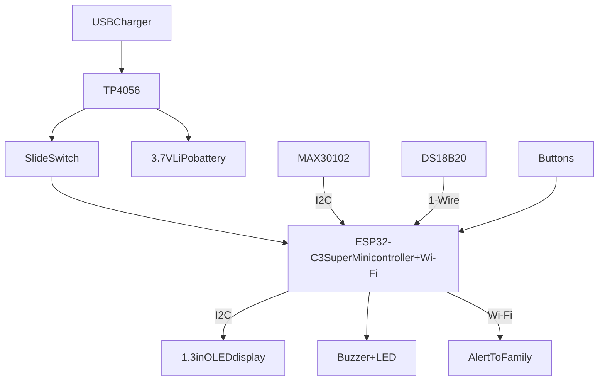

# SaludWatch
The SaludWatch is a monitoring aid device to help track temperature, blood oxy and heart rate while also showing you the time. 
These functions help elderly people track their vitals and know when to take medicine without having to walk to get a device, its simple design makes it easy to understand.

I came up with the idea thanks to my grandma(As weird as it may sound). It all started with my grandma having to climb the stairs to the third floor of my three-story house because she felt dizzy, it was too much! Plus it was dangerous,
one might say "But can't you just move the monitoring aid to the first floor so she doesn't have to go all the way up?" That's an option, yes, however, my grandma likes having her items organized, moving it to the first floor would just make her forget it's there in the first place.
That's when I thought of a great invention, what if the monitoring aid was ON her at ALL times? It would probably look ugly, however if I disguise it as another device which is on you MOST of the time, like a watch, then it would be better!
And that's how SaludWatch was born, the Wi-Fi, LED and buzzer functions were added later after discovering what the ESP32-WROOM-32 has(And can do).

(Drawings I made of how the SaludWatch could look)

Now, let's get technical, how does it really work?

