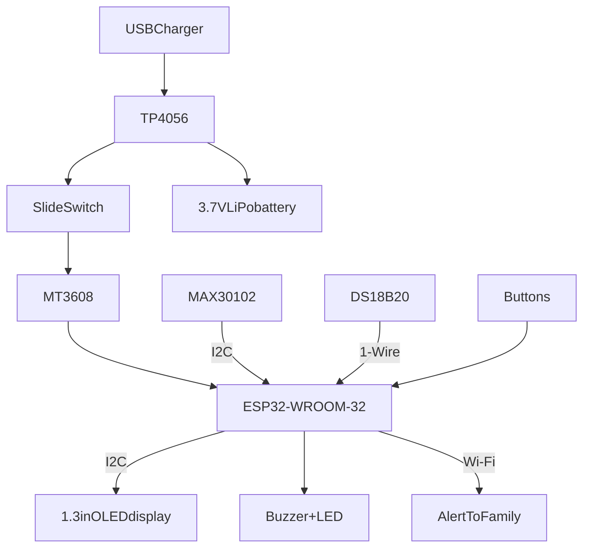

# SaludWatch
The SaludWatch is a monitoring aid device to help track temperature, blood oxy and heart rate while also showing you the time. 
These functions help elderly people track their vitals and know when to take medicine without having to walk to get a device, its simple design makes it easy to understand.

I came up with the idea thanks to my grandma(As weird as it may sound). It all started with my grandma having to climb the stairs to the third floor of my three-story house because she felt dizzy, it was too much! Plus it was dangerous,
one might say "But can't you just move the monitoring aid to the first floor so she doesn't have to go all the way up?" That's an option, yes, however, my grandma likes having her items organized, moving it to the first floor would just make her forget it's there in the first place.
That's when I thought of a great invention, what if the monitoring aid was ON her at ALL times? It would probably look ugly, however if I disguise it as another device which is on you MOST of the time, like a watch, then it would be better!
And that's how SaludWatch was born, the Wi-Fi, LED and buzzer functions were added later after discovering what the ESP32-WROOM-32 has(And can do).

(Schematic of the SaludWatch)

## Now, let's get technical, how does it really work?

+ The sensors, display, buzzer, and buttons connect to an ESP32-WROOM-32 development board.
+ The board reads the sensors, draws everything on a small OLED display, and uses its built-in Wi-Fi to sync the time and send alerts.
+ A LiPo battery powers it through a TP4056 charging module with battery protection (Using the USB charger).
+ And a MT3608 step-up converter raises the battery voltage to the 5V the board needs.

### Expected program flow
1. Boot, connect to Wi-Fi and sync to the local time zone then disconnect(Other modules are still active)
2. Time will show, the screen wakes up if any button is pressed.
3. Press the forward button to send a measurement request, wait 15-30 seconds after a "Keep still" notice, then show results on the OLED.
4. If the old person needs to take medicine soon or something is off, the buzzer will sound and the LED flash, an alert will ONLY be sent If something is off.
5. Otherwise the old person can check their vitals and then the device goes into energy-saving mode, wakes up on a button press.

## ESSENTIAL file locations

- `Hardware/` — 3D Case design and Schematic with wiring using labels
- `Hardware/Case/3DCase.f3d` — 3D Case design
- `Hardware/kicad/SaludWatch.kicad_pro` — Kicad Schematic + Wiring
- `Hardware/kicad/SaludWatch.kicad_sch` — Kicad Schematic + Wiring
- `Firmware/` — Code? Not yet, planned for the future functional prototype
- `Docs/` — Misc, non-editable files, images

## Layout + 3D design
The final third design of all my drawn designs, had to do a box because 3D modelling is hard ;(. (Especially considering I have never done it, I was happy once I found out I could make any weird shaped figure with the line and extrude tool!)

Board layout which I used to make the 3D Case model

Exterior view, here we can see the lid, walls and strap lugs. The lid has one hole for the OLED display and two square sized ones for the two buttons. At the strap lugs' side we can also see the slideSwitch hole and to the side another one for the DS18B20

(Only-Base view, see that hole in the distance? That's for the ESP32-WROOM32, and also opposite hole to the DS18B20 hole is for the micro-usb charger for the TP4056)

Lid+2layer view. Here we can appreciate the beautifully modelled lid, I even made a fit-able lid using the join operation with the extrude tool! And about the two layers, that coin sized hole is for the connections between all the modules. The layers aren't really attached at all, there's an space of 0.3mm from all sides with the two shelves I made[You can see them in the second pic]

## Limitations
Some parts such as the ESP32 board, the battery, the step up, and DS18B20 are very large and are only meant to prove the functionality of the prototype, they will change in a later version(They are also the only ones I found available near my hometown). I might also have mentioned that a blood pressure module would be added, but since they are VERY expensive(40$) and exceed the budget, those will be totally optional.
